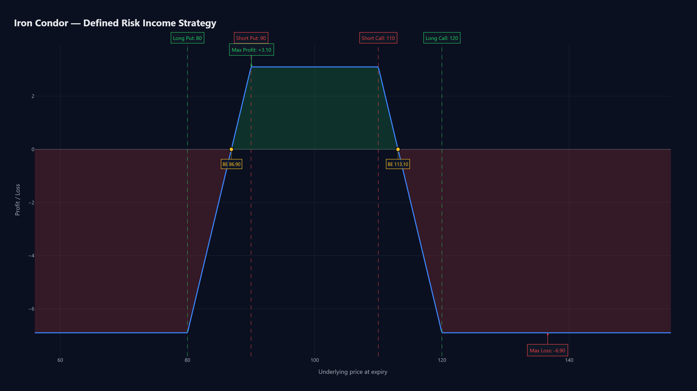

# OptionsKit

A modern Python toolkit for **European** options pricing, Greeks, and payoff visualization.

Make complex options concepts feel simple. Build a multi-leg strategy in a few lines and see the payoff at expiry as a clean, interactive Plotly chart — no spreadsheet required.



## Install

```bash
pip install optionskit
```

## Quick start

```python
from optionskit import Strategy

s = Strategy()
s.add_call(18500, premium=120, qty=-1)
s.add_put(17500, premium=100, qty=-1)

fig = s.plot_payoff(title="Short Strangle")
fig.show()
```

That's a short strangle. The interactive Plotly chart shows your P&L at expiry — profit shaded green, loss shaded red, and labeled strike markers for every leg.

## What's in V1

- **Pricing** — Black-Scholes for European calls and puts
- **Greeks** — delta, gamma, vega, theta, rho (plus `greeks(...)` for all five at once)
- **Implied volatility** — `implied_vol(price, S, K, T, r, kind)` via Brent's method
- **Strategies** — combine any number of European call/put legs, plus stock, long or short
- **Presets** — `straddle`, `strangle`, `bull_call_spread`, `bear_put_spread`, `iron_condor`, `covered_call`, `protective_put`, `butterfly`
- **Visualization** — interactive Plotly payoff charts with labeled strike markers, breakeven dots, and max profit / max loss annotations
- **Export** — `s.save_payoff("chart.html")` or `chart.png` (PNG/SVG/PDF need `kaleido`)

```python
from optionskit import black_scholes, delta, gamma, vega, theta, rho, greeks

black_scholes(100, 100, 1, 0.05, 0.20, kind="call")  # ~10.45
delta(100, 100, 1, 0.05, 0.20, kind="call")          # ~0.6368
gamma(100, 100, 1, 0.05, 0.20)                       # ~0.0188
vega (100, 100, 1, 0.05, 0.20)                       # ~37.52  (per 1.0 vol)
theta(100, 100, 1, 0.05, 0.20, "call", per_day=True) # ~-0.0176 / day
rho  (100, 100, 1, 0.05, 0.20, "call")               # ~53.23  (per 1.0 rate)

greeks(100, 100, 1, 0.05, 0.20, kind="call")
# {'delta': 0.6368, 'gamma': 0.0188, 'vega': 37.52, 'theta': -6.41, 'rho': 53.23}
```

Greeks are returned as raw mathematical derivatives. Use the convenience flags
to switch units: `vega(..., per_percent=True)`, `theta(..., per_day=True)`,
`rho(..., per_percent=True)`.

### Implied volatility

```python
from optionskit import implied_vol

implied_vol(price=10.45, S=100, K=100, T=1, r=0.05, kind="call")  # ~0.20
```

Raises `ValueError` if the price is outside no-arbitrage bounds (below
intrinsic or above the option's upper bound).

### Strategy presets

```python
from optionskit import presets

presets.iron_condor(
    put_long_strike=80,  put_long_premium=0.5,
    put_short_strike=90, put_short_premium=2.0,
    call_short_strike=110, call_short_premium=2.0,
    call_long_strike=120,  call_long_premium=0.5,
).plot_payoff(title="Iron Condor").show()
```

See [`examples/`](examples/) for `straddle`, `bull_call_spread`, `iron_condor`, and `covered_call`.

## Roadmap (V2)

- IV surface plotting (3D)
- Time-decay / "T-minus" overlays (plot P&L curves for multiple expiries)
- More presets (calendar spreads, ratio spreads, collars, ...)
- Interactive JS / React version

## Regenerating the hero image

```bash
pip install kaleido
python scripts/generate_hero.py
```

Outputs `docs/img/hero.png` (1600×900 @ 2× scale) and `docs/img/hero.html`.

## License

MIT — see [LICENSE](LICENSE).
